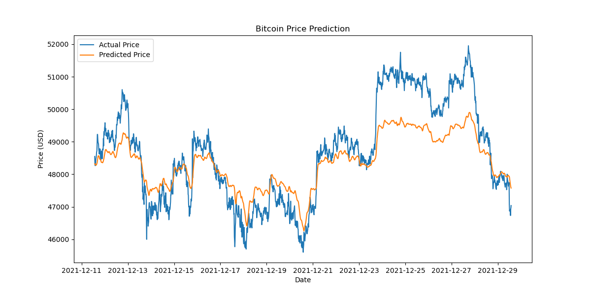

# BTC-timeseries-forecasting


## Forecasting Bitcoin Prices with Time Series Analysis

## Introduction

Time series forecasting plays a crucial role in financial markets, allowing investors and analysts to make informed decisions based on predicted future trends. This project focuses on applying time series analysis techniques to forecast Bitcoin (BTC) prices, one of the most volatile and influential cryptocurrencies in the market.

By leveraging advanced machine learning models and TensorFlow's powerful data processing capabilities, we aim to create a robust forecasting system that can capture the complex patterns in Bitcoin's price movements. This project demonstrates the potential of deep learning in financial forecasting and provides insights into the challenges and opportunities in predicting cryptocurrency prices.


## 1. An Introduction to Time Series Forecasting

Time series forecasting is a method of using historical time-ordered data to predict future values. In the context of financial markets, particularly for cryptocurrencies like Bitcoin, this approach is invaluable for several reasons:

- **Risk Management**: Accurate forecasts help investors and traders manage their risk exposure.
- **Strategy Development**: Predictions can inform trading strategies and investment decisions.
- **Market Understanding**: The process of forecasting provides insights into the factors influencing price movements.

Forecasting Bitcoin prices is particularly challenging and valuable due to the cryptocurrency's high volatility and the multitude of factors affecting its value, including market sentiment, regulatory news, and technological advancements.


## 2. Preprocessing Method

The preprocessing pipeline includes the following steps:

1. **Data Loading**: We load historical Bitcoin price data from a CSV file containing 15-minute interval data from Kaggle. See dataset [here](https://www.kaggle.com/datasets/nisargchodavadiya/bitcoin-time-series-with-different-time-intervals).
2. **Datetime Conversion**: We convert the 'Datetime' column to a datetime type and set it as the index.
3. **Checking For and Handling Missing Values**: We checked missing data points. There were none, so handling was not necessary.
4. **Feature Selection**: We focus on the 'Close' price as the target variable for prediction.
5. **Normalization**: We apply min-max scaling to normalize the price data to a range of [0, 1].

Here is a code snippet illustrating the preprocessing steps:

```python
df = pd.read_csv('data/BTC-USD-15-MIN.csv', parse_dates=['Datetime'])
df['Datetime'] = pd.to_datetime(df['Datetime'], utc=True)
df['Datetime'] = df['Datetime'].dt.tz_convert(None)
df.set_index('Datetime', inplace=True)
df.isnull().sum()
close_prices = df['Close'].values.reshape(-1, 1)
scaler = MinMaxScaler()
close_price_scaled = scaler.fit_transform(close_prices)
```

Justification for preprocessing choices:
- Parsing the 'Datetime' column as UTC timezone-aware datetime objects is to ensure that the timezone information is removed, and all timestamps are converted to naive datetime objects.
- Normalization is crucial for neural networks to converge faster and perform better.


## 3. Setting Up tf.data.Dataset for Model Inputs

We use TensorFlow's `tf.data.Dataset` API to create an efficient input pipeline:

1. We create sequences of 96 time steps (or 24 hours of 15-minute data) to predict the next time step.
2. The data is split into training (80%) and testing (20%) sets.
3. We use batching and prefetching to optimize performance.


```python
def create_dataset(data, time_steps=96):
    x, y = [], []
    for i in range(len(data) - time_steps):
        x.append(data[i:(i + time_steps)])
        y.append(data[i + time_steps])
    return np.array(x), np.array(y)

X, y = create_dataset(normalized_prices, time_steps=96)
train_size = int(len(X) * 0.8)
X_train, X_test = X[:train_size], X[train_size:]
y_train, y_test = y[:train_size], y[train_size:]

train_dataset = tf.data.Dataset.from_tensor_slices((X_train, y_train))
test_dataset = tf.data.Dataset.from_tensor_slices((X_test, y_test))
train_dataset = train_dataset.batch(32).prefetch(tf.data.experimental.AUTOTUNE)
test_dataset = test_dataset.batch(32).prefetch(tf.data.experimental.AUTOTUNE)
```

The importance of these techniques:
- Windowing allows the model to learn from historical patterns.
- Batching improves training efficiency.
- Prefetching ensures data is ready for the next training step, reducing idle time.


## 4. Model Architecture

We implemented a stacked LSTM network for this forecasting task:

```python
model = Sequential([
    LSTM(50, activation='relu', return_sequences=True, input_shape=(time_steps, 1)),
    LSTM(50, activation='relu'),
    Dense(1)
])

model.compile(optimizer=Adam(learning_rate=0.001), loss='mse')
```

It was chosen because:
- LSTM networks are well-suited for sequence prediction tasks and can capture long-term dependencies in time series data.
- The stacked architecture (two LSTM layers) allows the model to learn more complex patterns.
- ReLU activation helps mitigate the vanishing gradient problem.
- Adam optimizer adapts the learning rate during training for better convergence.


## 5. Results and Evaluation

After training the model, we achieved the following performance metrics:

- Train MSE: 0.0491
- Test MSE: 0.0009

- Mean Absolute Error (MAE): $667.49
- Root Mean Square Error (RMSE): $817.21

Here is a visualization of the model's predictions compared to the actual Bitcoin prices:



Observations and Insights from the BTC Price Prediction plot:

- The plot shows that model successfully captures the general trend of Bitcoin prices over the period, as observed from the predicted prices (orange line) closely following the actual prices (blue line). This indicates that the LSTM model can learn the overall direction and movement of the Bitcoin market, even though it may not predict exact price points.
- There is a noticeable lag in the predicted prices compared to the actual prices. This is a common issue in time series forecasting where the model's predictions react to changes in the trend with a delay. This lag might be due to the window size or the architecture of the LSTM layers. Further tuning of these parameters could potentially reduce this lag.
- The model struggles to accurately predict sharp movements and high volatility, which is evident from the deviations between the actual and predicted prices during sudden price changes. This suggests that while the model can capture the overall trend, it may not be as effective in predicting abrupt market reactions and short-term volatility.


Here is a visualization of the traing loss compared to the validation loss:


Observations and Insights from the Model Loss plot

- The training loss (blue line) starts relatively high and decreases over epochs, indicating that the model is learning and fitting the training data better over time.
- The validation loss (orange line) is consistently lower than the training loss and decreases smoothly. This suggests that the model is generalizing well to the validation data and is not overfitting to the training data.
- Both training and validation losses show a decreasing trend, indicating convergence. The validation loss, in particular, shows a steady decline without significant fluctuations, which is a good sign of model stability.
- The gap between the training and validation loss is small and stable, further suggesting that the model is not overfitting and is learning relevant features from the data.
- The current number of epochs (20) appears to be sufficient for the model to learn the underlying patterns in the data. However, further epochs could be explored to ensure the losses do not decrease further.
The learning rate seems appropriate, as the losses decrease steadily without significant jumps or oscillations. However, fine-tuning the learning rate could potentially lead to even better performance.


## 6. Potential Improvements:

- Feature Engineering: Incorporating additional features such as trading volume, technical indicators, or macroeconomic variables could provide more context to the model and potentially improve its predictions.
- Model Architecture: Experimenting with different architectures (e.g., GRU, CNN) or adding more layers and neurons could help in capturing complex patterns.
- Regularization and Dropout: Adding regularization techniques like dropout can help in reducing overfitting and might lead to better generalization on unseen data.
- Hyperparameter Tuning: Fine-tuning hyperparameters such as window size, batch size, and learning rate using techniques like grid search or random search could improve model performance.


## 7. Conclusion

This Bitcoin price forecasting project has provided valuable insights into the challenges and potential of applying deep learning to financial time series data.

Challenges faced:
- High volatility of Bitcoin prices makes accurate prediction difficult.
- Balancing model complexity with the risk of overfitting, and iterating to find the sweet-spot for the number of training epochs.
- Choosing the appropriate sequence length for prediction.

Potential and future work:
- This LSTM model shows promise in capturing trends in Bitcoin price movements.
- Further refinement could include incorporating additional features or experimenting with different architectures.
- This approach could be extended to other cryptocurrencies or financial instruments.

This project demonstrates the power of combining time series analysis with deep learning techniques for financial forecasting. While no model can predict future prices with certainty, this approach provides a foundation for understanding and anticipating Bitcoin price trends.

For the full implementation and to explore the code in detail see [Jupyter Notebook](https://github.com/CtripleU/BTC-timeseries/blob/main/Notebook.ipynb)
```
